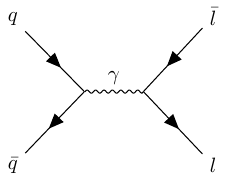

# `feynwrap.py`

Purpose: Writing tikz makes me sad, so I wrap a layer of python around it to allow continuous creation of vertices and edges in Feynman diagrams.

Drell-Yan Example:
```python
from feynwrap import node

# create a starting vertex
quark = node(vert='q')

# br stands for below right, other options include bl, al, ar
emVertex = quark.br().bl(vert='\\bar{{q}}', end=True)

# Let's goooooo
emVertex.propag(line='b',edge='\\gamma').br(vert='l',end=True).ar('af',vert='\\bar{{l}}')

node.save('demo.tex')

os.system("pdflatex --interaction=batchmode tikz-feyn.tex")
```

Result



The above example is the same as the following one liner
```python
node(vert='q').br().bl(vert='\\bar{{q}}', end=True).propag(line='b',edge='\\gamma').br(vert='l',end=True).ar('af',vert='\\bar{{l}}')
```

I wrote in python because programming in LaTeX is a pain.

-------------------------
This is the generated `demo.tex`
```latex
\begin{tikzpicture}
\begin{feynhand}
\vertex (v1)  {\(q\)};
\vertex (v2) [below right = of v1] ;
\vertex (v3) [below left = of v2] {\(\bar{{q}}\)};
\vertex (v4) [right = of v2] ;
\vertex (v5) [below right = of v4] {\(l\)};
\vertex (v6) [above right = of v4] {\(\bar{{l}}\)};

\propag [fermion] (v1) to (v2);
\propag [fermion] (v2) to (v3);
\propag [boson] (v2) to [edge label = \(\gamma\)] (v4);
\propag [fermion] (v4) to (v5);
\propag [anti fermion] (v4) to (v6);
\end{feynhand}
\end{tikzpicture}

```